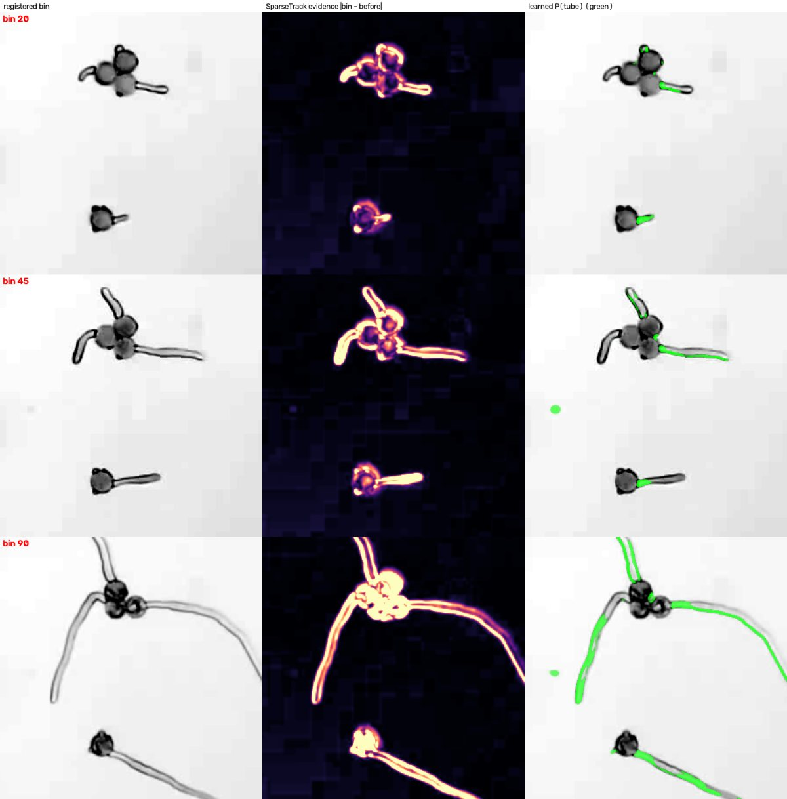

# TubeTracker: assessment of the work so far and the direction to a working prototype

> Nothing here changes the labelling tool, `sparsetrack/`, the benchmark labels, or the frozen `sparsetrack-0.4.0` tag.
> The new code lives in `prototypes/learned_evidence/` on branch `claude/magical-maxwell-i5tpeh`, plus one launcher,
> `Analyze_Movie_Learned.command`.

*24 September 2026. Written from a full read of every branch (`main`, `feature/burst-candidate-detection`,
`snapshot-2026-09-23`, `sparse-reset-2026-09-23`), the research ledger (H1–H491), the benchmark labels and reports,
plus runs of the legacy engine and SparseTrack on `sample_movie.avi` and a new experiment
(`prototypes/learned_evidence/`, section 5).*

---

## 1. Bottom line

1. **The sparse-first reset was the right call, and SparseTrack is the right foundation.** After about 490 logged
   hypotheses (v1 to v30), the pre-reset program ended with zero certified automatic lengths (H464, H468). SparseTrack,
   built in one day, is the first method measured against real human labels. It is also the best so far on every
   metric: onsets within ±600 frames for 13/28 grains, lengths within max(2 px, 10%) for 58/104 traces, median error
   2.8 px.
2. **Those numbers are in-sample and noisy.** They come from 28 grains, and the same labels were used to tune 0.3 and
   0.4.
   - 95% bootstrap intervals over grains: onset 29–64%, lengths 43–69%.
   - Even the gain from 0.2 to 0.4 is borderline (paired: onset +6 grains, 95% CI 0 to +12).
   - Held-out movie 2, the labels you are making now, is the first honest number. Score the frozen 0.4.0 on it once,
     and 0.4.3 (the long-tube fix, section 3.3) once, before changing anything else.
3. **The labelling tool is good, with one fixable validity problem.** Every one of the 32 Session A onset brackets is
   exactly one bin wide, because the tool defaults "last absent" to the bin before. Yet your blind retest moved
   first-visible by 8, 19 and 5 bins on three of seven grains. The benchmark therefore treats human onsets as far more
   precise than they are. For movie 2, shift-click an honest last-absent bin whenever the transition is not crisp.
4. **The direction: learned evidence, physics decoding, human review.**
   - Keep a physics decoder: tip growth only (lengths never shrink), onset, contact censoring. It encodes the biology
     the ledger established. On synthetic movies a simpler per-bin decoder did better than SparseTrack's end-state
     decoder, and far better when tubes burst (section 5). `ld_v1` decides between the two.
   - Replace its hand-built change evidence with a small network trained on SparseTrack's own codec-exact synthetic
     movies. They give unlimited, exact labels.
   - Put a model-prefilled review-and-correct step, built into the labelling tool, in front of the final numbers. It
     works now without changing the tool: `Review_Movie_Learned.command` opens the tool pre-filled with the model's
     answers.
   - This fixes what killed every earlier learned model: 5–135 human labels and a network asked to make global
     decisions. It keeps what works, and each piece can be measured on the benchmark you already have.
5. **The experiment behind this recommendation (section 5).** A 0.49 M-parameter network was trained only on synthetic
   movies, in 30 minutes on CPU, with no real labels. It was scored on twelve held-out or untouched synthetic movies
   (324 grains).
   - Along the true tube geometry, its evidence puts 91% of lengths in tolerance, against 72% for SparseTrack's.
   - End to end through SparseTrack's unchanged decoder, lengths improve from 61% to 71% (paired +236 traces, 95% CI
     +106 to +363). Read instead by a simpler per-bin decoder, they reach 73% (+292, +170 to +413). Median error goes
     from 2.18 to 1.71 px.
   - Through the per-bin decoder the gain is positive on all twelve movies (+3 to +60 traces each). Through
     SparseTrack's decoder it ranges from −3 to +43. On the four movies nothing had touched until the end, lengths went
     from 59% to 72%, and to 77% with the per-bin decoder.
   - Onsets do not improve beyond noise.
   - When tubes burst and vanish, lengths measured before each burst stay in tolerance 71% of the time with the per-bin
     decoder, against 43–47% through SparseTrack's decoder.
   - On real footage it has never seen, it is tube-specific: near zero on grain bodies.
   - Whether it transfers to your movies takes one command on your Mac (appendix B), scored on `ld_v1`.
   - Fine-tuning it on about 90 sparse traces like yours (`finetune.py`) added up to 3.5 points on fresh synthetic
     movies whose tubes look different from its training. It cost accuracy on movies unlike the one it was tuned on.
     Its built-in check, which holds out grains and traced frames, gave the right verdict in all three tests.
   - Fitting one number on the same traces did more where tubes read consistently long. That number is the per-bin
     decoder's end offset (`calibrate.py`). On a fresh thick-tube movie it took lengths in tolerance from 41 to 90.
     Its check adopted it there, and rejected it on the two movies where it would have cost 5 and 7 lengths.
6. **The biggest single lever may be the microscope, not the code.** The movies are ~14 fps x264 at a QP-30 quality
   floor with a keyframe every 12 frames: about 0.9 KB per frame for faint 2–5 px tubes. For new experiments, record
   lossless time-lapse (one 16-bit frame every 10–20 s, about 1 GB/h) with hardware autofocus. Every method gets
   easier.

**This week:**
1. Finish the movie-2 labels (about an hour, section 3.5).
2. Freeze 0.4.3 with the long-tube fix (section 3.3), then score 0.4.0 and 0.4.3 on movie 2, once each.
3. Answer the five questions in section 6.
4. Run the learned-evidence test on `ld`, then calibrate the decoder on the same traces (appendix B). One
   double-click does both, and fine-tuning after them: `Adapt_Learned_To_Dev_Movie.command`.
5. Try prototype v1's loop on a movie: `Analyze_Movie_Learned.command`, then `Review_Movie_Learned.command`, which
   opens your labelling tool pre-filled with the model's answers and exports the reviewed results. `pipeline.py`
   also writes a review gallery on the movie, the population curve (T50), growth curves and a per-grain CSV, in µm
   and minutes once question 1 is answered.

---

## 2. What exists (inventory)

| Generation | Where | Period | What it is | Status |
|---|---|---|---|---|
| Upstream TubeTracker | `main` (`TubeTracker.py`) | 2024–25 | wxPython GUI. Hough grains, skeleton-endpoint or template tips, motpy linking, manual QC and bursts. Published: Yimga Ouonkap et al., *Plant Reproduction* 38:16 (2025) | Reference only |
| Modernised engine | `tubetracker/{gui,analysis,models,views}.py`, `scripts/run_pilot.py` | Jul 2026 | Same algorithms, modular, LapTrack linking, CLI pilot runner, reviewer-first burst candidates | Kept, not developed |
| Research program v1–v30 | ledger H1–H491; code at tag `snapshot-2026-09-23` | 13 Jul – 22 Sep | Kymograph/DP trackers, tomography and min-cut formulations, TimesFM priors, a weakly supervised tip CNN, the v30 owner-conditioned temporal U-Net with a napari annotator and review queues (1,274 tests) | Frozen; pruned at the reset |
| **SparseTrack 0.4.2** | `sparsetrack/` | 23 Sep | Keyframe-bin cache, per-grain registration, end-state path candidates, monotone DP growth front, matched-stub onset, Turnbull population curve, review gallery, codec-exact synthetic benchmark | **Active** |
| **Benchmark labelling tool** | `sparsetrack/bench/` | 23–24 Sep | Local web app for census, onset brackets, exit-to-apex traces (near, wide and extra-wide views), contact and burst answers, and blind retest; autosave plus journal | **Active; movie-2 labelling in progress** |
| Human benchmark | `benchmark/labels/ld_v1.json` | 23 Sep | Session A: 39-grain census, 32 onsets, 127 traces, 7 retests | Dev set (tuned on) |
| **Learned-evidence prototype** | `prototypes/learned_evidence/` (branch `claude/magical-maxwell-i5tpeh`) | 24–25 Sep | Synthetic-trained evidence network and per-bin decoder. Double-click launchers: analyse any movie; adapt to the dev movie (decoder calibration and fine-tuning, each behind a check); review and correct through the labelling tool, pre-filled | **Prototype; the `ld` test decides** |

---

## 3. Assessment

### 3.1 Upstream TubeTracker (baseline)

I ran it headless on `sample_movie.avi` with the manual's settings (blur 7, background 55).
- It took ~23 s end to end.
- It found 32 grains and called 26 germinated, but produced **114 tip tracks for roughly 40 real tubes**. That is the
  fragmentation the manual tells users to fix by hand with "link tracks".
- Every frame is resized to the screen size (1000×725 on the reference display): 0.78× horizontally and 0.71×
  vertically. Tubes lose resolution and the aspect ratio is distorted.
- Bursts are manual.
- A few latent bugs:
  - `update_burst` uses `self.is_germinated == False` (a comparison, not an assignment).
  - `segment_inputs` uses `**` instead of `*` in `gv12`.
  - `Start_TubeTracker` runs `find ~/` over the whole home folder.
- It is a reasonable published baseline for fast 1-frame-per-minute movies. It is not a basis for the lab's current
  14-fps compressed movies.

### 3.2 The research program, 13 Jul – 22 Sep (v1 to v30)

The ledger is an unusually honest record. Its durable findings should be kept and cited:

- **Tip growth only, so arclength never decreases.** The tube is the tip's trail. Frame-to-frame growth is sub-pixel
  to a few pixels, and apparent motion of the tube is rigid swing of the whole tube.
- **Appearance lags existence (H25).** New wall matures optically over tens of frames. Any tracker measures the
  *developed* front; onset is best reported as an interval.
- **One frame is too noisy.** Single-frame evidence buries faint tubes, so temporal pooling is the minimum. Absolute
  thresholds do not transfer between movies.
- **Material-point trackers and flow fail on this footage.** CoTracker landmarks drifted 47–76 px, and dense optical
  flow blew up on textureless brightfield (H3). CoTracker3 did hold up for rigid grain pose (H98).
- **Zero-shot foundation segmenters do not see these tubes.** Tube IoU: Cellpose-SAM 0.005, µSAM 0.008–0.108 (H334).
  SAM2 did not lock onto faint tubes (H2).
- **Tip coherence is a first-class metric.**

What did not work, and why. This matters for the recommendation.

- **Learned models were starved of labels, and the labels had the wrong form.**
  - The v1 tip CNN was trained on 1,539 weak labels mined from tracker output. It was frozen after every retrain
    failed its probe gates (H181–H264).
  - The v30 owner-conditioned U-Net was trained on 5–135 human samples. It collapsed to constant outputs (a dead ReLU,
    H347), learned prompt and position shortcuts (H316b), never separated owners (H349, H372, H411), and picked the
    right tip 0/6–0/8 times (H268–H407b).
  - Late in the program, a tip-cap model reached 65/75 tips within 5 px after hard-negative mining (H462). **Networks
    can see these tips; what failed was the data regime and asking the network to make global decisions.**
- **Process swamped progress.** There were certification gates, ownership contracts, review queues, 1,274 tests and
  about 490 hypotheses, scored mostly on a handful of cases (P0016, P0034, cf70). The ledger records an 80–100 px
  "phantom" corridor that was measured bit-exactly by four methods (H20). Bit-exact agreement proved method equals
  method, not method equals reality.

Verdict: the reset (freeze v30, prune, benchmark first, sparse first) was correct.

### 3.3 SparseTrack 0.4.x

**Design.** One grain at a time, on registered 300-frame keyframe averages:
- Take the end-state change map and trace candidate centrelines (one per branch end or rim contact).
- Read a kymograph along each candidate, allowing a rigid swing about the exit.
- Find a non-decreasing DP growth front, and pick the candidate whose monotone growth explains the most evidence.
- Call onset with a matched stub filter plus hysteresis.
- Censor length at contact with other grains.
- Report a Turnbull NPMLE population curve (interval-censored, with T50) and a review gallery ordered by path
  coverage.

**Strengths.**
- It is physically grounded and fast: about 40 s per movie after a 30–40 s cache build.
- It is interpretable, with per-grain diagnostics.
- It has sound statistics for censored onsets.
- It comes with a codec-exact synthetic benchmark (v1–v5) and held-out discipline. It is the first method in the
  project with a scoreboard.

**Scores on the dev benchmark** (`ld_v1`: 28 isolated grains, 104 FULL traces; from `benchmark/reports/ld_v1_scores.md`):

| Version | Onset within ±600 frames | Lengths within max(2 px, 10%) | Median length error |
|---|---|---|---|
| v29.19.3 (pre-reset field pipeline) | 4/22 | 49/96 | 3.76 px |
| SparseTrack 0.1 | 4/28 | 46/104 | 3.61 px |
| SparseTrack 0.2 | 7/28 | 48/104 | 3.62 px |
| SparseTrack 0.4.0 (frozen for movie 2) | 13/28 | 58/104 | 2.81 px (bias −3.4 px) |
| SparseTrack 0.4.1 | 14/27 | 61/104 | 2.76 px |
| Your own blind retest (onset, 7 grains) | 4/7 | — | — |

Looser tolerances for 0.4.0:
- Onset within ±2,400 frames: 22/28.
- Lengths within max(5 px, 20%): 79/104.

**How to read these numbers.** I bootstrapped over grains, because traces from one grain are correlated.
- 95% intervals for 0.4.0: onset 29–64%, lengths 43–69%. Each trace is about 1% of the length metric.
- Paired against 0.2.0 on the same grains: onset +6 grains (95% CI 0 to +12) and lengths +10 traces (−2 to +23). This
  is borderline even in-sample.
- Most of the 23 September commits moved the score by 1–3 traces while choosing parameters on this same set. That is
  within noise, and it risks overfitting 28 grains.

**Known failure classes** (from the reports and `compare.html`):
- tubes that curl over their own grain;
- ownership where a tube contacts another grain;
- sway;
- paths that stop short of the frame edge;
- early spurious rotation, since fixed by the exit pivot.

**Structural limits.**
- Isolated grains only: 28/39 on the dev movie, 82/122 on movie 2.
- Lengths stop at first contact.
- **Long tubes are cut off at a fixed ±150 px window, with no flag** (found on 24 September, while preparing for
  movie 2):
  - Each grain is read in a 300 × 300 px crop (`Params.half = 150`). A tube that leaves the crop stops growing at its
    edge.
  - This never happens on `ld`, whose farthest trace point is 112 px from its grain. Movie 2 runs twice as long, and
    your commit notes say some of its tubes pass ±128 px by the last bins.
  - On a synthetic movie of movie 2's length, 34 of 493 traces reach past the crop.
    - SparseTrack as is gets 9 of the 20 scored ones in tolerance.
    - Re-reading the 4 grains whose path ends at the crop edge, with a ±300 px crop, gets 20 of 20. Their lengths go
      from 138–150 px to 156–268 px.
    - The other 33 grains are bit-identical.
  - Paths longer than about 268 px also crash `matched_kymograph`: OpenCV's `remap` takes fewer than 32,767 rows,
    and there are 61 angles × 2 points per px. Reading the angles in groups fixes it, with identical results.
  - Both fixes exist as tested wrappers in `prototypes/learned_evidence/evaluate.py` (`adaptive_crop`, `_chunked`).
    They belong in `sparsetrack/analyze.py` as 0.4.3, frozen **before** movie 2 is scored.
- Everything hangs on the end-state change map: a tube that fades or bursts, or a tube pushed around non-rigidly,
  breaks the path.
- Time resolution is one bin (300 frames).
- There is no burst or growth-arrest output, which the lab's survival analysis needs.
- There are no physical units: the real frame interval is unrecorded (H358), and pixel size is not in the cache.

**My runs here.**
- The SparseTrack tests pass (27; one needs ffmpeg). The six failing tests belong to the frozen v30 app and fail only
  because `torch` is missing.
- On `sample_movie.avi` it runs end to end in about 2 minutes. That movie is out of distribution (fast growth, one
  frame per bin). Many curves look right, but some paths land on background in the overlay, and four grains get late
  spurious onsets (bins 97–120). This is a qualitative smoke test only.
- `sparsetrack prepare` with the default 300 frames/bin crashes (`IndexError`) on a 129-frame movie; only `run`
  auto-sizes bins. The launchers are macOS-only, and movie paths are hard-coded to `~/Downloads`.

### 3.4 The newest annotation app (the SparseTrack benchmark labelling tool)

**What it does.**
- The grain census: confirm, exclude with a reason, or add grains, with a close-up view.
- The onset: a whole-movie filmstrip of 4-bin tiles, then 18 single bins, with keyboard verdicts.
- Exit-to-apex polyline traces at planned times: onset + 6 bins, 40%, 70% and the last full bin. There are three
  views: near, wide (±128 px) and, since 24 September, extra-wide (X, ±256 px), which slides inward at the movie's
  edges. Movie 2's longest tubes need the extra-wide view.
- Tube states: full, partial, no tube or unsure, plus a contact flag. Since 24 September, also burst (B): the tip
  ruptured, so the grain's later trace times drop out. Scoring skips burst traces and reports how many.
- An 8-grain blind retest of onsets.
- Every click autosaves atomically to JSON, and an append-only journal records each answer.

**Strengths.** This is the best labelling instrument the project has built.
- It uses only the standard library and has no install friction.
- It refuses to mix a labels file with the wrong movie's cache.
- Views follow each grain's own drift, and out-of-frame pixels are hatched.
- It uses a fixed random sample for held-out labelling, which avoids the bias of taking the first N grains.
- Blind retest is built in, so human noise is measured rather than assumed.
- The vocabulary matches `annotation_schema.GerminationEvent`.
- It is fast. The journal shows Session A took about 50–60 minutes of active clicking: 178 answers, mostly between
  16:28 and 17:12.

**Issues, in order of importance.**
1. **Onset brackets are artificially narrow.** The last-absent bin defaults to first-visible − 1. Session A never
   overrode it, so all 32 brackets are one bin wide, while the retest disagreed by up to 19 bins. Any prediction
   outside a falsely narrow bracket is scored as an error.
   - *Fix now, by how you label:* shift-click an honest last-absent bin when unsure.
   - *Fix in the tool, after movie 2:* require an explicit last-absent click, or offer a "crisp / uncertain" toggle.
2. **Only onsets are retested.** Human length noise is unknown, so nobody can say whether 58/104 is near the ceiling.
   Add a 15-trace blind retest.
3. **The onset criterion is implicit.** The help text says "first tile where a tube is clearly visible growing out".
   The g014 "bulge" (19 bins apart on retest) and the v30 "bump vs tube" debate (H484) show this needs a written rule,
   for example "a protrusion of at least 3 px beyond the rim outline, at the angle the tube later grows". The rule
   should be shown in the tool.
4. **One annotator.** There is no inter-rater agreement. A second person labelling 10 grains of `ld` would
   calibrate the benchmark.
5. **Labels are judged on the same registered bin averages the model reads.** Registration or averaging artefacts are
   therefore shared by truth and prediction. This is acceptable for now; spot-check a few traces on raw keyframes.
6. **Fixed trace times** (40%, 70% and last bin) oversample long, late tubes, which are the ones most likely to touch
   something. On movie 2 (~351 bins) many late traces may be `contact` and drop out of the metric.

### 3.5 The annotation tasks you still need to complete

- **Now (required): movie 2 held-out, `Label_Movie2_Heldout.command`.** A fixed random sample of 30 isolated grains
  away from the edge; labels go to `benchmark/labels/m2_v1.json`.
  - Steps:
    1. Census check: confirm each sampled grain, or exclude it with a reason.
    2. Onset for each grain.
    3. About 3–4 traces per germinated grain, roughly 90–120 in total.
    4. The 8-grain retest at the end.
  - Movie 2 has about twice as many bins as `ld`, so the filmstrips are longer. Expect **about 1–1.5 hours of active
    work**.
  - Before you start:
    - Keep it blind: do not open any SparseTrack output for movie 2 first.
    - Mark an honest last-absent bin whenever the transition is not crisp.
    - Use U (can't tell) and P (partial) rather than guessing.
    - Press T on every trace that touches another tube or grain, and B when the tube has burst.
    - Do the retest after a break.
  - When you finish:
    1. Commit `m2_v1.json` and its journal.
    2. Before scoring anything, freeze 0.4.3: 0.4.2 plus the two long-tube fixes (section 3.3). They are label-free
       and leave `ld` unchanged, so choosing them now is not tuning on movie 2.
    3. Score **0.4.0 once** (the pre-registered baseline), then 0.4.3 once (commands in appendix C). Record both in
       `benchmark/reports/`.
- **Soon (cheap, raises the value of both benchmarks):**
  - A 15-trace blind retest on `ld`, about 10 minutes.
  - A written onset rule, applied from now on.
  - A second annotator on 10 `ld` grains.
- **Park:** the v30 napari queues (the 172 "competitive windows", the H474 exit tasks, the 50 stale tasks). They serve
  the frozen app.
- **Later (after prototype v1):** review-mode corrections. Every accept or fix in the review loop is a new label.
  Label a third held-out movie once movie 2 has scored two or three frozen versions. Label dense-field grains (clumps
  and crossings) only when the prototype expands past sparse fields.

---

## 4. Direction

### 4.1 What "working prototype" should mean (acceptance criteria)

- **One step:** drop in a movie, enter the seconds per frame and µm per pixel, and get results in minutes on a laptop.
- **Outputs, per grain:**
  - germination status and onset interval;
  - growth-arrest or burst frame;
  - length and growth-rate curves in µm and minutes;
  - QC flags;
  - per movie: the population germination curve (Turnbull, T50) and CSV plus figures.
- **Review:** flagged grains are shown first, with one-click accept or fix. Corrections are saved as labels.
- **Accuracy:** measured on held-out human labels, and **after review within human test-retest agreement**. Automatic
  accuracy is reported alongside, with intervals.
- **Scope, stated honestly:** isolated grains in v1. Clumps and crossings are counted and excluded, with a per-grain
  density covariate reported, because germination can depend on local pollen density.

### 4.2 Recommended architecture: learned evidence → physics decoder → human review

```
registered bins ──► [1] learned evidence ──► [2] physics decoder   ──► [3] review & correct ──► results
 (bin, before,        per-bin P(tube),        per-bin reading or the  prefilled in the         CSV, curves,
  after crops)        P(tip), later P(burst)  end-state path; growth  labelling tool           population
                                              only, onset, censoring
```

1. **Learned evidence.** A small U-Net (0.49 M parameters) reads the same three images SparseTrack uses: the bin, the
   "before" reference and the "after" reference. It outputs the probability that each pixel is built tube, plus a tip
   heatmap.
   - It is trained on codec-exact synthetic movies from `sparsetrack synth`: real fields and grains, real measured
     tube cross-sections, contrast maturation, sway, drift, docking particles and the real x264 settings. This gives
     unlimited training data with exact labels.
   - Then it can be fine-tuned on the real `ld` traces (`finetune.py`), and later on review corrections. The tuned
     model is kept only if a check that holds out grains and traced frames says it reads more right. On synthetic
     tests the gains were small (up to 3.5 points), and a tuned model belongs to the imaging conditions it was tuned
     on (section 5).
2. **A physics decoder.** Either of two decoders, both with growth only, onset and contact censoring. These carry
   the biology.
   - SparseTrack's decoder traces candidate paths on the end state, rotates and swings them, and runs the monotone DP
     front.
   - The per-bin decoder (`reach.py`) measures the tube region's length in every bin, then makes it monotone. Its
     end offset can be fitted on a movie's traces (`calibrate.py`).
   - On synthetic movies the per-bin decoder did better with learned evidence: +56 lengths on twelve held-out movies,
     and far better when tubes burst (section 5).
   - `pipeline.py` scores both on `ld_v1`, so real footage decides between them.
3. **Review and correct.** The labelling tool, opened on the model's predictions. Each grain is confirmed or fixed
   with the same onset-bracket and trace gestures, and every fix is a new label.
   - This works now without changing the tool. `prefill.py` writes the per-bin decoder's answers as a labels file,
     through the tool's own API, marked as the model's. `Review_Movie_Learned.command` opens it, and
     `export_review.py` writes the reviewed results: which answers were checked and changed, and the germination
     curve.
   - What the tool itself could add: ordering grains by flags, and a one-key "accept".

**Why this, and why now:**
- **It fixes the causes of past learned failures.** Those models had 5–135 labels and were asked to decide ownership
  and selection. Here labels are unlimited and exact (synthetic), the network only supplies local evidence, and the DP
  makes the global, physically constrained decision.
- **It has strong precedent.** Networks trained purely on physically simulated microscopy data, then validated on
  real data, displaced hand-built pipelines in single-molecule localisation (DECODE, Speiser et al., *Nat. Methods*
  2021). Synthetic crossing tubes improved crossing handling in pollen Mask R-CNN work (Zhang et al., *J. Exp. Bot.*
  2023).
- **It reuses what exists.** The generator, the decoder, the benchmark and the tool are already built. The integration
  is one file: a probability "cache" that SparseTrack reads like a movie (`prototypes/learned_evidence/evaluate.py`).
- **It is cheap to falsify.** The real-data test (appendix B) takes about 1.5 hours on a Mac. If it does not beat 0.4.x
  on `ld_v1`, you have lost a day, not a month.

### 4.3 Where modern foundation models fit (and where they don't)

| Technology (2025–26) | Use here | Why not more |
|---|---|---|
| SAM 3 / 3.1 (Meta, Nov 2025 / Mar 2026) | none now | Gated weights, 848 M parameters, needs a CUDA GPU; zero-shot is weak on thin, faint, niche structures |
| SAM 2.1, µSAM (MIT) | annotation help: mask drafts for grains | Already failed zero-shot on tubes (H2, H334) |
| Cellpose-SAM / Cellpose 4 (DINOv3 variants) | optional grain census | Grains are already easy (the FRST/rim detector); models are trained on CC-BY-NC data |
| DINOv3 (Aug 2025), frozen features + small head | optional backbone for the evidence net once real fine-tuning starts | Gated and custom-licensed; 16-px patches are coarse for 2–5 px tubes, so it needs full-resolution cues or an upsampler (AnyUp) |
| CoTracker3 / TAPNext++ / AllTracker | rigid grain pose or drift QC | Track material points, not a moving growth front; CoTracker is CC-BY-NC |
| RF-DETR (Apache-2.0), Spotiflow (BSD) | if you ever move to detecting grains and tip points | Ultralytics YOLO is AGPL, including your trained weights |
| Trackastra, motile, laptrack | dense-field linking later | Not needed for per-grain sparse analysis |
| VLMs (Claude, Gemini, GPT) | not for measurement | The ledger shows vision reads misjudged small structures (H373, H375, H480) |

The breakthrough is not a bigger pretrained model. It is **turning your own simulator into a training-data factory**
and letting a verified physical decoder make the decisions.

### 4.4 Acquisition: the cheapest large win for future movies

The current movies are ~14 fps H.264 at a QP-30 quality floor with a keyframe every 12 frames. The dev movie is 45 MB
for 52,583 frames of 1280×1024. SparseTrack must average 25 keyframes per bin to recover SNR, and faint tubes are
attenuated by the codec itself: synth measured a 50% transfer for a 5-grey-level line.

For new experiments:
- **Record time-lapse, not video.** One frame every 10–20 s is plenty for sub-pixel growth per frame.
- **Save lossless 16-bit TIFF** (or ND2/CZI). That is about 1 GB/h at 1280×1024.
- **Turn on hardware autofocus** (e.g. Nikon PFS or Zeiss Definite Focus) against the documented focus drift.
- **Fix exposure and gain.**
- **Store seconds per frame and µm per pixel with every movie.**

If the lab has the raw originals of the current movies, re-export them losslessly. Where a line is available, a
pollen-expressed fluorescent marker (e.g. a LAT52 promoter fusion) turns tube tracking into an easy bright-on-dark
problem.

### 4.5 Roadmap, with gates

| When | Deliverable | Gate |
|---|---|---|
| Now | Finish movie-2 labels; freeze 0.4.3 (long-tube fix); score 0.4.0 and 0.4.3 once each | First held-out numbers, with bootstrap intervals |
| Week 1 | **Prototype v1:** SparseTrack 0.4 (or learned evidence with the per-bin decoder, if `ld_v1` confirms it) plus review-and-correct in the labelling tool (working now through pre-filled labels: `Review_Movie_Learned.command`), physical units and one-click run/export (macOS and Windows). `pipeline.py` already writes the review gallery on the movie, the population curve (T50), growth curves and a per-grain CSV in µm and minutes. Show the growth-arrest frame and burst candidates for review only: on synthetic movies an arrest read off the length curve lands within ±3 bins less than half the time | Lab runs it on a real experiment; corrected results reproduce your manual measurements within retest agreement |
| Weeks 2–3 | **Learned evidence on real data:** appendix B on `ld`; then `calibrate.py` and `finetune.py` on the `ld` traces, each kept only if its check adopts it; freeze; score once on movie 2 | Beats 0.4.x on `ld_v1` beyond noise (paired bootstrap), then holds on movie 2 |
| Weeks 3–4 | **Decoder v2, the per-bin decoder (built, in `pipeline.py`).** It reads length where the tube *is* in each bin (`reach.py`: medial-axis length through P > 0.5, made monotone over bins) instead of rotating one end-state path. On twelve held-out synthetic movies it takes learned evidence from 71% to 73% of lengths in tolerance (61% for SparseTrack as it is). It removes the drifting-grain weakness and holds up when tubes burst (71% against 43–47%). A hybrid with SparseTrack's decoder did not help | Beats SparseTrack's decoder on `ld_v1`, then holds on movie 2 |
| Weeks 3–4 | Burst head, trained on synthetic bursts (add to `synth`) plus reviewed bursts. Movie 2's burst answers are the first real burst labels, bracketed by trace times. The per-bin decoder's burst safeguard protects lengths but cannot time bursts (5 of 28 within ±2 bins) | Burst frame within ±2 bins on held-out reviews |
| Weeks 4–8 | Dense fields: instance-aware evidence (which grain owns each tube pixel), learned with synthetic foreign tubes and crossings (v2+ presets); ownership decided by birth time and geodesic reach | Contact-censored fraction halves without losing isolated-grain accuracy |
| Ongoing | Acquisition protocol for new experiments; a new held-out movie every 2–3 frozen versions | — |

### 4.6 Process: how to avoid another 490 hypotheses

1. **Keep one scoreboard.** It holds, each with paired bootstrap intervals:
   - the dev score (`ld_v1`);
   - the held-out score (movie 2);
   - the synthetic scores: development v5 seeds 5 and 16–21, held-out 3, 4, 6, 7, 8 and 13–15, untouched test 22–25.

   A change counts only if it clears noise on the dev set and does not regress the synthetic held-out. One synthetic
   movie, or even five, cannot settle an effect of a few points; compare on eight or more.
2. **Never tune on held-out data.** Score each frozen version once. Retire a held-out movie after two or three
   versions and label a fresh one (30 grains ≈ 1 hour).
3. **Grow the benchmark rather than the code.** Thirty more labelled grains shrink the intervals more than any
   parameter tweak changes the score.
4. **Scope each AI-agent session to one gated experiment.** Give it a written hypothesis and a benchmark-delta
   acceptance test. It may not add new subsystems without a measured deficit. Keep the ledger to one line per
   experiment.
5. **Freeze v30.** Retire the napari annotator and its queues until dense fields are in scope.

---

## 5. Experiment: does synthetic-trained evidence beat SparseTrack's evidence?

**Setup** (code in `prototypes/learned_evidence/`, README there).

- **Training data.** Five codec-exact synthetic movies from `sparsetrack synth`: preset v5 seeds 0–2, v2 seed 1 and
  v3 seed 2. They are built on the only real field in the repository, the pre-germination frames of
  `sample_movie.avi`. The training set is 5,600 crops, with exact per-bin truth rasterised from the generator's own
  geometry (`truth.py`, unit-tested against what the renderer draws).
- **Model.** A 0.49 M-parameter U-Net. It reads the same three registered images as SparseTrack (bin, before, after)
  and outputs P(tube already built) and P(tip). It trained for 5,000 steps on 4 CPU cores in about 30 minutes.
  **No real labels were used.** This is model v1. Model v2 (ten training movies, below) is used from "More synthetic
  data" on, and is the one shipped in `prototypes/learned_evidence/models/`.
- **Evaluation data.**
  - Held-out synthetic movies, preset v5 (sway, rotation, drift, contrast maturation, blurred tips, docking
    particles, touching and crossing tubes): seed 3 for Test 1, seeds 3, 4, 6, 7 and 8 for Test 2. They were never
    used for training or for any choice.
  - Model v2 was later chosen over v1 on those five movies. So three movies nothing had touched (seeds 13–15) were
    added, then six development movies (16–21) and four untouched test movies (22–25) for the decoder work.
  - A separate development seed 5, used for the two integration choices below.
- **The section, in order:**
  1. Test 1, evidence alone.
  2. Test 2, end to end (v1).
  3. More synthetic data (v2).
  4. Replication on fresh movies.
  5. Decoder v2.
  6. Bursting tubes.
  7. Real footage.
- **Three evidence sources through the same decoder.**
  - SparseTrack's own evidence (0.4.2 defaults).
  - Learned evidence.
  - "Perfect" evidence: the exact truth masks, which measures the ceiling of SparseTrack's current decoder.

**Test 1: evidence only.** Each evidence source is sampled along each tube's *true* per-bin geometry and fed to
SparseTrack's own `dp_front`. Differences here come only from evidence quality. Held-out seed 3: 19 tubes, 173 trace
points.

| Evidence | Lengths within max(2 px, 10%) | Median error | Bias | Absences correct | Onset within 2 bins |
|---|---|---|---|---|---|
| `abs` (\|change\|) | 74/173 (43%) | 3.22 px | −6.9 px | 77/77 | 0/19 |
| `matched` (end-state cross-section) | 116/173 (67%) | 1.88 px | −2.5 px | 57/77 | 5/19 |
| `union` (SparseTrack's default) | 124/173 (72%) | 1.78 px | −1.7 px | 57/77 | 5/19 |
| **learned** | **157/173 (91%)** | **1.12 px** | **+0.1 px** | **77/77** | **8/19** |

**Test 2: end to end.** The unchanged SparseTrack pipeline, run on the image cache (baseline) and on the learned
probability cache.
- **Integration choices, made on the development seed only and then frozen:**
  - Onset comes from the growth front. SparseTrack's matched stub filter z-scores against control angles that are
    exactly zero on probability maps, so it called grains "emerged at start"; on the development seed it got 3/22
    onsets against 15/22 from the front.
  - Tip offset is 0 px (2 px scored worse).
- **Held-out data:** five movies (preset v5, seeds 3, 4, 6, 7, 8), 135 scored grains.

| Evidence → SparseTrack 0.4.2 decoder | Onsets within ±2 bins | Lengths within max(2 px, 10%) | Median length error | Bias | Control false positives | Germinations missed |
|---|---|---|---|---|---|---|
| SparseTrack's own evidence (baseline) | 79/112 | 623/1024 (61%) | 2.12 px | −3.4 px | 5/23 | 6 |
| **Learned evidence (v1)** | 82/112 | **699/1014 (69%)** | **1.62 px** | −2.2 px | **2/23** | 12 |
| Perfect evidence (exact truth; ceiling) | 102/112 | 760/1014 (75%) | 1.33 px | −0.8 px | 2/23 | 8 |

**Paired over the 135 grains (learned − baseline):**
- Lengths: +76 traces (95% CI −16 to +165; P(not better) = 0.05).
- Onsets: +3 (95% CI −10 to +16).
- Learned evidence closes more than half the gap between SparseTrack's evidence and the decoder's ceiling on
  lengths. It does not move onsets.

**Where it helps and where it hurts.** Lengths within tolerance by tube type:

| Tube type (held-out) | SparseTrack evidence | Learned v1 (5 movies) | Learned v2 (10 movies) | Perfect |
|---|---|---|---|---|
| Bright-cored | 119/292 (41%) | **203/292 (70%)** | **206/292 (71%)** | 200/292 (68%) |
| Sways | 215/369 (58%) | **284/369 (77%)** | **296/369 (80%)** | 299/369 (81%) |
| Touches or crosses | 190/329 (58%) | 214/319 (67%) | 221/319 (69%) | 243/319 (76%) |
| Rotates | 142/257 (55%) | 163/257 (63%) | 172/257 (67%) | 170/257 (66%) |
| Faint (amplitude < 1.3) | 234/394 (59%) | 260/394 (66%) | 285/394 (72%) | 316/394 (80%) |
| Dark line | 504/732 (69%) | 496/722 (69%) | 528/722 (73%) | 560/722 (78%) |
| Curls | 134/262 (51%) | 134/262 (51%) | 157/262 (60%) | 157/262 (60%) |
| Drifts | 224/335 (67%) | **189/325 (58%)** | **206/325 (63%)** | 226/325 (70%) |

**Reading:**
- The gains are where SparseTrack's hand-built evidence is weakest. Bright-cored tubes read nearly perfectly: 70%,
  against a 68% ceiling.
- v1's weak spots were drifting grains and twice as many missed germinations (12 against 6): the network missed some
  faint tubes near the grain entirely. Those looked like training-data problems (5 synthetic movies, 5,600 crops),
  so v2 tests the cheapest lever the approach has: more synthetic movies.

**More synthetic data (model v2).** The same network and recipe, trained on ten synthetic movies instead of five
(v5 seeds 0–2 and 9–11, v2 seeds 0–1, v3 seeds 0 and 2: 11,200 crops) for 6,000 steps. Nothing else changed: same
integration choices, same held-out movies.

| Evidence → SparseTrack 0.4.2 decoder | Onsets within ±2 bins | Lengths within max(2 px, 10%) | Median length error | Bias | Control false positives | Germinations missed |
|---|---|---|---|---|---|---|
| SparseTrack's own evidence (baseline) | 79/112 | 623/1024 (61%) | 2.12 px | −3.4 px | 5/23 | 6 |
| Learned v1 (5 movies) | 82/112 | 699/1014 (69%) | 1.62 px | −2.2 px | 2/23 | 12 |
| **Learned v2 (10 movies)** | **86/112** | **734/1014 (72%)** | **1.60 px** | **−0.9 px** | **2/23** | **7** |
| Perfect evidence (exact truth; ceiling) | 102/112 | 760/1014 (75%) | 1.33 px | −0.8 px | 2/23 | 8 |

- Paired over the 135 grains, v2 − v1: lengths +35 traces (95% CI +6 to +70), onsets +4 (−3 to +12). v2 is ahead
  on all five held-out movies.
- v2 − SparseTrack's evidence: lengths +111 traces (95% CI +25 to +195), onsets +7 (−5 to +19).
- On lengths, v2 closes 81% of the gap between SparseTrack's evidence and perfect evidence. Missed germinations fall
  from 12 to 7 (SparseTrack's own: 6). Curls reach the perfect-evidence score, and faint tubes go from 66% to 72%.
- Drifting grains remain the weak spot: 63%, against 67% with SparseTrack's evidence.
- On the development seed v2 is level with v1: 141 against 144 of 192.
- `pipeline.py` now defaults to the ten-movie recipe. That choice was made on these held-out synthetic movies, so
  `ld_v1` and movie 2 remain the untouched tests.
- The decoder is now the limit. Learned evidence sits 26 traces below perfect evidence, and perfect evidence itself
  stops at 75%.

**Replication on three fresh movies.** v2 was chosen over v1 on the five held-out movies above. So I rendered three
more that nothing had touched (v5 seeds 13–15, 81 grains) and ran everything once.

| Evidence → SparseTrack 0.4.2 decoder | Fresh movies (13–15): lengths | All eight held-out movies: lengths | Eight movies: onsets | Eight movies: median error |
|---|---|---|---|---|
| SparseTrack's own evidence | 389/612 (64%) | 1012/1636 (62%) | 129/181 | 2.08 px |
| **Learned v2** | 398/601 (66%) | **1132/1615 (70%)** | 133/181 | **1.68 px** |
| Perfect evidence (ceiling) | 416/601 (69%) | 1176/1615 (73%) | 158/181 | 1.45 px |

- On the fresh movies the gain is within noise: paired +9 traces (95% CI −47 to +64).
- Pooled over all eight held-out movies (216 grains), it holds: +120 traces (95% CI +17 to +226; P(not better) =
  0.01). Onsets +4 (−11 to +19).
- Per movie, the gain runs +18, +13, +11, +26, +43, −3, −2 and +14 traces. Learned evidence helps most where
  SparseTrack's evidence is weakest, so its gain depends on the mix of tubes:
  - bright-cored tubes: 71% against 50%;
  - sways: 80% against 62%;
  - rotations, crossings and faint tubes: 7–10 points each;
  - drifting grains read worse (56% against 63%).
- Lesson: five synthetic movies (135 grains) cannot size an effect of a few points. Use eight or more, and keep a
  fresh set for the last check.

**The decoder's own ceiling.** With perfect evidence, SparseTrack 0.4.2 reaches only **73%** of held-out lengths
within tolerance (eight movies; 75% on the first five, 58–89% per movie) and 87% of onsets.
- The losses are rotating tubes, curls and drifting grains. A grain that drifts 39 px gets zero length even with
  perfect evidence.
- Those losses come from the end-state path plus rigid rotation, so better evidence alone cannot pass ~75%. That
  motivates *decoder v2* (section 4.5).
- **A per-bin decoder** (`prototypes/learned_evidence/reach.py`) reads the tube where it is in each bin. It takes the
  region with P > 0.5 attached to the grain and measures its length along the medial axis, then fits a monotone
  curve over bins (L1).
  - Tuned on the development seed, it beat SparseTrack's decoder there: 151 against 141 of 192 lengths with learned
    evidence.
  - Frozen and scored once, it lost on the first five held-out movies (707 against 734; paired −27, 95% CI −82 to
    +28). It won on the three fresh ones (437 against 398; +39, −15 to +91).
  - Pooled over eight movies it is a tie: 1144 against 1132 of 1615 (+12, −67 to +88).
- On those eight movies the per-bin decoder was better on dark tubes, curls, crossings, rotations and drift, and worse
  on bright-cored tubes and sways. That suggested a hybrid, so I tested one properly (below).
- A width-aware end correction for wide tubes was fixed before the fresh test. It helped with perfect evidence but
  hurt with learned evidence (403 against 437), so it was dropped.

**Decoder v2: a hybrid was not needed; the per-bin decoder alone was better on new movies.** A per-grain switch has
to be chosen without touching held-out movies. So I rendered six new development movies (seeds 16–21; with seed 5,
191 grains) and four untouched test movies (seeds 22–25, 108 grains). Both decoders read the same learned v2
evidence.
- **Development (seven movies).**
  - The per-bin decoder alone beat SparseTrack's on every tube type: 1073 against 989 of 1399 lengths (77% against
    71%; paired +84, 95% CI +32 to +139). Onsets 112 against 110 of 156.
  - I tried label-free switches: tube width, path coverage, drift, rotation, and whichever decoder reads the tube
    longer. Each rule's threshold was chosen on six movies and scored on the seventh. None beat using the per-bin
    decoder everywhere.
  - A per-grain oracle would reach 82%, so the two decoders do complement each other, but not in a way these
    features can see.
  - The per-type pattern from the first eight held-out movies did not recur.
- **Frozen for the test, before any test movie was scored:** the per-bin decoder alone against SparseTrack's, on
  lengths, paired over grains.
- **Test (four untouched movies):**

| Evidence → decoder | Lengths within max(2 px, 10%) | Onsets within ±2 bins |
|---|---|---|
| SparseTrack's evidence → SparseTrack's decoder (0.4.2 as it is) | 504/860 (59%) | 69/95 |
| Learned v2 → SparseTrack's decoder | 620/860 (72%) | 67/95 |
| **Learned v2 → per-bin decoder** | **664/860 (77%)** | **74/95** |

  - Per-bin − SparseTrack's decoder: lengths +44 (95% CI −6 to +98), onsets +7 (0 to +14).
  - Learned evidence − SparseTrack's evidence, through SparseTrack's decoder: +116 (+36 to +195). This is a clean
    replication of the section's main result.
- **Pooled over all twelve held-out and test movies (324 grains):**
  - Learned evidence with the per-bin decoder gets 1808/2475 lengths in tolerance (73%). SparseTrack as it is gets
    1516/2496 (61%): paired +292 traces (95% CI +170 to +413). Onsets 208 against 198 of 276, and missed
    germinations 11 against 12.
  - By tube type, against SparseTrack as it is: crossings 77% against 54%, sways 78% against 61%, rotations 74%
    against 58%, faint tubes 73% against 56%, curls 71% against 54%, bright-cored tubes 66% against 49%, and dark
    lines 76% against 65%. Drifting grains tie (64% against 62%).
  - Per-bin against SparseTrack's decoder, both on learned evidence: +56 traces (−38 to +149) and onsets +8 (−4 to
    +20).
- **So decoder v2 is the per-bin decoder, not a hybrid.** It is simpler, and ahead on every set except the first
  five held-out movies: development +84, held-out +12 in all, test +44. It also removes the drifting-grain weakness.
  `pipeline.py` now scores it as a third run, so `ld_v1` decides it on real footage.

**Bursting tubes.** Movie 2's burst answer means a tube left "nothing to trace" after bursting. So I made tubes vanish
in four synthetic movies, 28 bursting tubes in all: from a random bin on, each tube was inpainted away, leaving a
faint ghost. The truth marks the first later trace time "burst" and drops the rest, as the labelling tool does.

| Decoder (same movies) | Lengths before the burst, bursting tubes | Same tubes, movie without bursts |
|---|---|---|
| SparseTrack as it is | 69/159 (43%) | 87/159 (55%) |
| Learned v2 → SparseTrack's decoder | 74/159 (47%) | 114/159 (72%) |
| **Learned v2 → per-bin decoder** | **113/159 (71%)** | 130/159 (82%) |

- SparseTrack's decoder reads each tube's path at the end of the movie. When the tube has vanished by then, it loses
  the tube's earlier lengths and onset too: 40 traces lost with learned evidence, 18 with its own. Its own
  change map still sees the ghost, which is why it loses less.
- The per-bin decoder reads each bin as it comes, so it loses only 17.
- A burst-aware fit (`reach.py burst=True`: fit growth only up to a reading that collapses for good) added +11
  lengths on the development movie and +5 on the three test movies, with one false burst in three burst-free
  movies. It is on by default in `pipeline.py` as a safeguard. Its burst frame is not reliable (5 of 28 within ±2
  bins), so it is not reported as a measurement.
- For movie 2: expect SparseTrack 0.4.x to be wrong on grains whose tube bursts, onset included. This is one more
  reason to score the per-bin decoder there. The emulated burst is a guess at what a real one looks like, and your
  burst answers will show whether it holds.

**Transfer to real footage (qualitative).** `sample_movie.avi` is real, with different optics and thicker,
bright-cored tubes; the network has never seen its tubes.



- SparseTrack's change evidence lights up whatever changed: grain bodies (the brightest objects), tube walls and
  blocky codec noise.
- The learned probability is tube-specific: near zero on grain bodies, and it follows most tubes.
- It misses the wide, dark-walled tube at left in bin 45, and finds it only partly in bin 90. Its cross-section is
  outside the synthetic profiles, which is the gap the next training round must close: wider profiles in `synth`,
  then fine-tuning on the 127 real `ld` traces.
- It also flags one small out-of-focus particle.
- **Wider synthetic tubes did not close the gap (model v3, not adopted).** Four more training movies had tubes
  1.3–2.5× wider (`data.EXTRA_PRESETS["v5w"]`).
  - On the thin-tube held-out movies the lengths did not move (−2 and −4 traces against v2, 95% CIs about ±27), and
    onsets improved (+7 with the per-bin decoder, CI +1 to +14).
  - On the sample movie it did not help. It still called 16 grains tubeless, and it marked less of one thick tube
    than v2.
  - Real thick tubes are not simply wider synthetic ones. What closes the gap is fine-tuning on real traces, or
    measuring their cross-section for `synth`. v2 stays the shipped model.
- **End to end on the same movie, without labels, the three runs disagree widely.** `pipeline.py` now runs without
  `--labels` and writes a per-grain CSV.
  - The learned evidence calls 16 of 37 grains tubeless, where SparseTrack calls 7.
  - Final lengths for the same grain differ by up to about 100 px between runs.
  - This movie's thick, dark-walled tubes and single-frame bins are outside anything the network was trained on, so
    this is expected and says little about your movies. `ld_v1` is the test that matters.
- **The review gallery showed where the per-bin decoder goes wrong on real footage.** `review.py` draws the region
  the decoder read on the movie itself, and that exposed a bug and two limits:
  - Near the frame edge, the padded border made straight streaks that the network took for tube, giving a false
    264 px tube. The decoder now ignores pixels that leave the movie in any bin, as SparseTrack does. On the eight
    held-out synthetic movies this changes no scored result.
  - A grain touching another grain can lose its tube to the neighbour when the region is split between them.
    Scored benchmarks exclude such grains, but per-grain outputs include them.
  - Where a real tube's contrast changes, the learned probability can fade. The burst safeguard then keeps the
    length reached, which was the right call here.
  - With that fixed, the per-bin decoder calls 36 of the 37 grains germinated, against 30 for SparseTrack. Two
    crowded-field failures account for the gap:
    - a grain that drifts away leaves its place to whatever passes;
    - where tubes cross, the region touching the rim switches to another tube.
  - Two review flags now mark these: `no_grain_after:<frame>` for a grain whose disc has lost its contrast, and
    `unsteady:<k>/<n>` for a reading that keeps jumping off its fit.
  - They mark 6 of the 7 grains where the two decoders disagree, and none of 60 grains on two synthetic movies. The
    gallery and the pre-filled review show them first. `ld` is a low-density movie, so these should be rarer there.
- **A growth-arrest frame cannot be read reliably off the length curves.** Tried on the seven development movies (49
  truth arrests, 106 tubes still growing at the end):
  - The rule "first bin within δ of the final length, flat for at least n bins" finds at most 22 of 49 arrests
    within ±3 bins, at the cost of 28 false arrests. With few false arrests (2), it finds 13.
  - A growth-then-plateau change-point fit does no better.
  - Slow growth (0.15–1 px per bin), bin-to-bin noise and curves that flatten in the last bins, where the "after"
    reference sits, make the plateau ambiguous. Prototype v1 should show an arrest frame for review, not report it
    as a measurement. A dependable one needs its own evidence, such as the network's tip output standing still.

**Fine-tuning on sparse human traces (synthetic test).** `finetune.py` tunes the network on one movie's traces. Here
the traces were made from synthetic truth to look like yours: the same bins as `ld` (70, 122 and 174, plus one near
onset) and the same number of clicks for a tube's length (2 below 15 px, 5 for 40–80 px). About 90 traces from 27
grains per movie. The movies have tubes the shipped model was not trained on: faint (0.35–0.7× contrast), thick
bright-cored (2–3× wider) and wide (`v5w`). Each was scored at every bin against the full truth.
- **Four faults in the first version, each found and fixed on the development movies:**
  - Tube labelled in the round cap past the traced apex made every tube read ~1.5 px long: −38 lengths.
  - With traces from three frames only, the network learned those frames. Other grains read better in them (+13
    points) and worse elsewhere (−4.5 points beyond 12 bins).
    - A check that splits grains alone, and scores at the traced frames, showed +10 lengths where the truth was −9.
      On `ld` too, the late traces all sit on bins 70, 122 and 174.
    - So the check now folds frames as well as grains, with no label within 3 bins of a scored frame. And the labels
      are spread over time, using growth only: before onset the future path is background; between two traces the
      tube reaches at least the earlier one and at most the later one.
  - A fixed background band fell inside thick tubes' walls, where the start model was right to see tube (it agreed
    with only 69% of that "background"). Background now starts past the tube's width measured on the image.
  - Tuned on faint tubes, the network began to see tubes on grain rims: 3 of 27 grains emerged in the first bin, and
    16 bins before onset were read as tube. A ring round each grain is now background away from its own trace, and
    that fell to 2 bins.
- **Final version:**

  | Tuned on | Same movie, cross-validated | Check's verdict | Fresh movie of the same kind | Thin-tube movie (v5 seed 5) |
  |---|---|---|---|---|
  | Faint tubes | 49.7% → 48.7% | not adopted | 61.1% → 60.7% | −29 lengths (95% CI −47 to −12) |
  | Thick tubes | 28.1% → 33.5% | adopted | 21.3% → 22.2% | −3 (−13 to +7) |
  | Wide tubes | 71.2% → 74.5% | adopted | 75.5% → 79.0% | −10 (−22 to +1) |

  - Percentages are lengths in tolerance over all bins, per-bin decoder. The fresh movies were scored once, after
    the method was frozen.
  - The check's verdict was right all three times. Where it said no, the tuned model helped nothing on a fresh movie
    and did clear harm on thin tubes.
  - Gains are small. They come where tube appearance differs from the synthetic training, and they do not travel:
    a tuned model belongs to the imaging conditions it was tuned on.
  - Onsets did not move beyond noise on any movie.

**Calibrating the decoder on sparse human traces (synthetic test).** The per-bin decoder adds a constant, 1 px by
default, to every length it reads, because the medial axis stops short of a tube's end. How far short depends on how
the evidence looks there. `calibrate.py` fits that constant on a movie's traces. It picks the offset from −6 to +3 px
with the most lengths and onsets in tolerance. Same movies and traces as above, offset picked on the development movie
and then applied to a fresh one:

| Movie | Check on the development traces (lengths, 95% CI) | Verdict | Fresh movie, lengths in tolerance (full truth) |
|---|---|---|---|
| Thick tubes (the start model reads them 5.6 px long) | +19 (+8 to +31), offset −5 | adopted | 41 → 90 |
| Faint tubes | +3 (−3 to +10), offset +3 | not adopted | would have been 119 → 114 |
| Wide tubes | +1 (−11 to +13), offset 0 | not adopted | would have been 156 → 149 |

- Where tubes read long or short by about the same amount, one number more than doubles the lengths in tolerance.
  Fine-tuning barely moved the same bias (+5.6 to +5.0 px).
- Where the error grows with length, as with faint tubes, no single offset fixes it.
- After calibration, fine-tuning added nothing on thick tubes: 90 → 84 lengths on the fresh movie (95% CI −18 to +7).
  Fine-tuning's check, reading with the calibrated offset as it does by default, did not adopt it (−1, −4 to +2).
  Calibrate first, then let fine-tuning's check decide.
- Picking the best of ten offsets on the same traces flatters small gains. On faint and wide tubes the point estimate
  was positive and the truth negative. So calibration is adopted only when the interval lies above zero. Fine-tuning,
  which picks nothing, keeps the plain rule, and that rule was right for it.
- Letting the traces also pick the probability threshold lost against the full truth (wide tubes: 191 against 201
  lengths and onsets in tolerance). Only the offset is fitted.
- `calibrate.py` also tries calling germination at another length (1–8 px instead of 2), judged on onsets. On these
  movies it was never adopted, and rightly so. With truth-made labels 2 px was already about right. With an
  annotator who calls tubes visible only at 6 px, thick tubes' readings jump past every threshold in one bin, so no
  threshold helps. On `ld` it may: human "first visible" is where the benchmark's onsets are weakest.
- **A caveat on onsets in these fine-tuning and calibration tests.** They were scored at the scorer's default of
  600 frames, which on the synthetic movies (counted in keyframes) means ±24 bins, not the ±2 bins it means on
  your movies. So "onsets no worse" was a loose guard here. Lengths are unaffected. The main held-out tables above
  use ±2 bins, and on `ld` both tools score onsets at ±2 bins.

**What these results do and don't show.**
- **Do:**
  - With geometry held fixed, learned evidence from synthetic data alone is decisively better than SparseTrack's
    evidence: 91% against 72%.
  - End to end, over twelve held-out and untouched movies, it improves lengths from 61% to 71% through SparseTrack's
    decoder, and to 73% through the per-bin decoder. Doubling the synthetic training data helped (v2 over v1: +35
    traces, 95% CI +6 to +70).
  - It looks tube-specific on real footage it has never seen.
  - Both halves of the recommended architecture matter: better evidence and then a better decoder.
  - Fine-tuning on about 90 traces helps a little where tubes look different, and its check tells when it does.
- **Don't:**
  - These are synthetic held-out numbers on the sample movie's field, from 30-minute CPU training runs.
  - Onsets improve only within noise.
  - The gain varies from movie to movie, and three fresh movies alone did not show it (+9, −47 to +64).
  - A decoder change that gained 10 traces on the 27-grain development seed lost 27 on held-out movies. Choices made
    on one synthetic movie are noise at this scale.
  - The real test is the dev benchmark `ld_v1` on your movie (appendix B, one command), then movie 2 once a model is
    frozen.

---

## 6. Questions only the lab can answer

1. What is the real acquisition interval (seconds per frame) of `test1lowdensjoshua-28c-hz` and movie 2? Were they
   recorded as 14-fps video or as time-lapse exported at 14 fps? What is the pixel size in µm?
2. Do raw or lossless originals exist on the acquisition PC?
3. What density must prototype v1 handle? Is "isolated grains, with clumps counted and excluded" acceptable for the
   first experiments the lab wants to run?
4. Is there GPU access (for example Brown CCV's Oscar) for the fine-tuning step, or is CPU/MPS the budget? The
   experiment here was CPU-only.
5. Who else could label 10 grains, so there is an inter-rater number?

---

## Appendix A: numbers used here

- Dev movie `test1lowdensjoshua-28c-hz.mp4`: 1280×1024, 52,583 frames, 14 fps container, 4,382 keyframes (every 12
  frames), 45 MB. 176 bins of 300 frames. 39 census grains (28 isolated, scored).
- Movie 2 (`Pollen tube movie 2 7-14-26.mp4`): about 105k frames. Census 122 grains (82 isolated). First ~9 bins
  skipped as settling. 30 grains sampled (seed 20260923).
- Session A (`ld_v1`): 39 grains (8 excluded: 5 clump, 1 not a grain, 1 out of focus, 1 other), 32 onsets (all
  `emerged_within`, all brackets one bin), 127 traces (120 full, 6 unsure, 1 no tube). FULL lengths 2.4–109.7 px,
  median 25.1. The journal shows ~50–60 min of active labelling.
- Upstream engine on `sample_movie.avi`: ~23 s, 32 grains, 26 germinated, 114 tip tracks, analysis at 1000×725
  (0.78/0.71 scaling).
- SparseTrack 0.4.2 on `sample_movie.avi`: 37 grains (28 isolated), 114 s including the overlay video.

## Appendix B: run the learned-evidence test on your real dev movie

Run this on your Mac, where the movies and prepared caches live, from a separate checkout so your labelling copy is
untouched:

```bash
cd ~/path/to/TubeTracker                       # your repo
git fetch origin
git worktree add ../TubeTracker-learned origin/claude/magical-maxwell-i5tpeh
cd ../TubeTracker-learned
ln -s ../TubeTracker/runs runs                 # reuse your prepared caches (runs/sparsetrack/ld)
ln -s ../TubeTracker/.venv .venv               # and your environment, for the double-click launchers
../TubeTracker/.venv/bin/pip install torch==2.13.0   # the project's `cnn` extra, if not installed
../TubeTracker/.venv/bin/python -m prototypes.learned_evidence.pipeline \
    --field runs/sparsetrack/ld --labels ../TubeTracker/benchmark/labels/ld_v1.json --work runs/learned_evidence/ld
```

- **Your labels:** every command here reads them from your main checkout (`../TubeTracker/benchmark/labels/`),
  where the labelling tool saves them. The worktree's own copy is the branch's and may be older.
- **Time:** about 1.5 hours. That is ten synthetic movies on the `ld` field (~5 min each), training (~30 min on
  CPU, faster on an Apple GPU, which is picked automatically) and a probability cache for the real movie.
- **Or all of this appendix in one go:** double-click `Adapt_Learned_To_Dev_Movie.command` in the worktree (or run
  `python -m prototypes.learned_evidence.adapt --labels ../TubeTracker/benchmark/labels/ld_v1.json`). It runs this test, then the calibration and fine-tuning below, in
  that order. It reads your current labels from the checkout that holds `runs/`, and skips steps already done. If
  your labels have changed since a step ran, it offers to run every step again on them (`--redo`; the trained model
  is kept). It ends with `runs/learned_evidence/SUMMARY.md`: what each step found, what the launcher now uses, and
  the movie-2 command.
- **Output:** three runs, each scored on `ld_v1`, with paired bootstraps of the differences:
  - SparseTrack 0.4.2 as it is;
  - learned evidence through SparseTrack's decoder;
  - learned evidence through the per-bin decoder (decoder v2), with its burst safeguard.
- **One double-click, any movie:** `Analyze_Movie_Learned.command` prepares a chosen movie, runs all three without
  labels, and opens the review gallery. It uses the model trained on your dev movie once that exists.
- **Any movie, no labels:** leave out `--labels`. The pipeline then writes all three runs' predictions and a
  `per_grain.csv` instead of scores. Add `--um-per-px` and `--s-per-frame` to get µm and minutes.
- **Only the per-bin decoder:** once `ld_v1` has shown it is the one to use, `--only-perbin` (or `ONLY_PERBIN=1` in the
  launcher) skips the two comparison runs. The results are the same and it runs about twice as fast.
- **For review, in `perbin/`:**
  - a gallery of every grain drawn on the movie itself: six bins from onset to the end, with the region read and its
    length curve;
  - the population germination curve (Turnbull, T50);
  - growth curves.

  With `Review_Movie_Learned.command` (the labelling tool, pre-filled with the model's answers, then the reviewed
  results exported), that is prototype v1's loop.
- **Quick first look (about 10 minutes):** add `--model prototypes/learned_evidence/models/unet_v2_sample_field.pt`
  to skip the synthetic movies and training. That model is v2 from section 5, trained on synthetic movies built on
  `sample_movie.avi`'s field. The full run above, on your own field, is still the proper test.
- **Long tubes:** every run reads a grain again at ±300 px when its tube reaches the ±150 px crop edge (section 3.3;
  `--fixed-crop` turns this off). On `ld` no path gets there, so nothing changes.
- **Then, calibrating the decoder on your traces (about 10 minutes):**

  ```bash
  ../TubeTracker/.venv/bin/python -m prototypes.learned_evidence.calibrate --field runs/sparsetrack/ld \
      --labels ../TubeTracker/benchmark/labels/ld_v1.json --work runs/learned_evidence/ld_cal
  ```

  - It fits the per-bin decoder's end offset on the model trained above.
  - It writes `decoder.json` only if a check over folds of grains shows a gain clear of noise. The launcher and the
    commands below then use it.
- **Then, fine-tuning on your traces (about 45 minutes):**

  ```bash
  ../TubeTracker/.venv/bin/python -m prototypes.learned_evidence.finetune --field runs/sparsetrack/ld \
      --labels ../TubeTracker/benchmark/labels/ld_v1.json --work runs/learned_evidence/ld_ft
  ```

  - It starts from the model trained above, and reads an adopted calibration as the launcher does.
  - It tunes one model per fold of grains and traced frames, and scores each fold's grains at that fold's frames.
    No model has seen those grains, nor any label within 3 bins of those frames.
  - `report.txt` gives the paired difference against the starting model.
  - The final model is written as `unet_ft.pt` only if the tuned models read more lengths or onsets right, and
    neither fewer. The launcher then uses it.
  - Use it only for movies taken under the same conditions as `ld` (section 5).
- **Movie 2:** only after freezing a model, and only once. That is `runs/learned_evidence/ld_ft/unet_ft.pt` if
  fine-tuning was adopted, otherwise the model below. Add `--decoder runs/learned_evidence/ld_cal/decoder.json` if
  calibration was adopted:

  ```bash
  ../TubeTracker/.venv/bin/python -m prototypes.learned_evidence.pipeline --field runs/sparsetrack/m2 \
      --labels ../TubeTracker/benchmark/labels/m2_v1.json --model runs/learned_evidence/ld/unet.pt \
      --work runs/learned_evidence/m2 --heldout-once
  ```

## Appendix C: score movie 2 once, when the labels are in

Run these on your Mac, from your repo, after `m2_v1.json` is committed and 0.4.3 (the long-tube fix, section 3.3)
is tagged. They only read the labels, so they cannot change them.

```bash
cd ~/path/to/TubeTracker
# 1. The frozen baseline, from its own worktree (your checkout is not touched)
git worktree add ../st-0.4.0 sparsetrack-0.4.0
cd ../st-0.4.0
../TubeTracker/.venv/bin/python -c "import sparsetrack; print(sparsetrack.__version__, sparsetrack.__file__)"
#    must print 0.4.0 and a path inside st-0.4.0
../TubeTracker/.venv/bin/python -m sparsetrack analyze ../TubeTracker/runs/sparsetrack/m2 \
    --grains ../TubeTracker/benchmark/labels/m2_v1.json --out ../TubeTracker/runs/sparsetrack/m2_0.4.0
cd ../TubeTracker
# 2. 0.4.3, from your checkout
.venv/bin/python -m sparsetrack analyze runs/sparsetrack/m2 --grains benchmark/labels/m2_v1.json \
    --out runs/sparsetrack/m2_0.4.3
# 3. One report for both
.venv/bin/python -m sparsetrack eval --labels benchmark/labels/m2_v1.json \
    --pred runs/sparsetrack/m2_0.4.0/predictions.json runs/sparsetrack/m2_0.4.3/predictions.json \
    --out benchmark/reports/m2_v1_scores.md
```

- Both versions read the same cache, and the cache format is unchanged since 0.4.0 (`sparsetrack.cache.v1`).
- Commit the report as generated. Then neither version is scored on movie 2 again.
- The learned-evidence run on movie 2 comes later, once a model trained on the dev field is frozen (appendix B). If
  fine-tuning is adopted, the tuned model is the frozen one, and an adopted calibration goes with it (`--decoder`).
  Score one learned model on movie 2, once.
